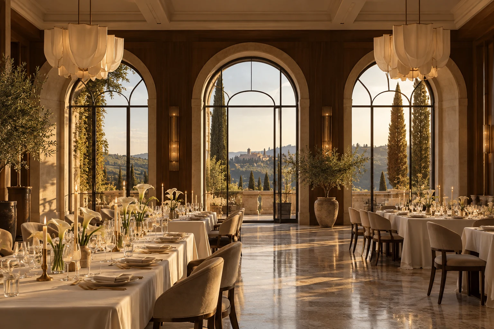
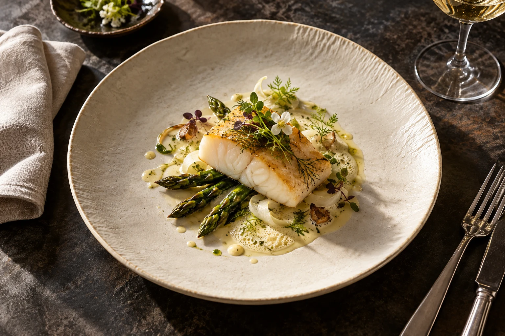
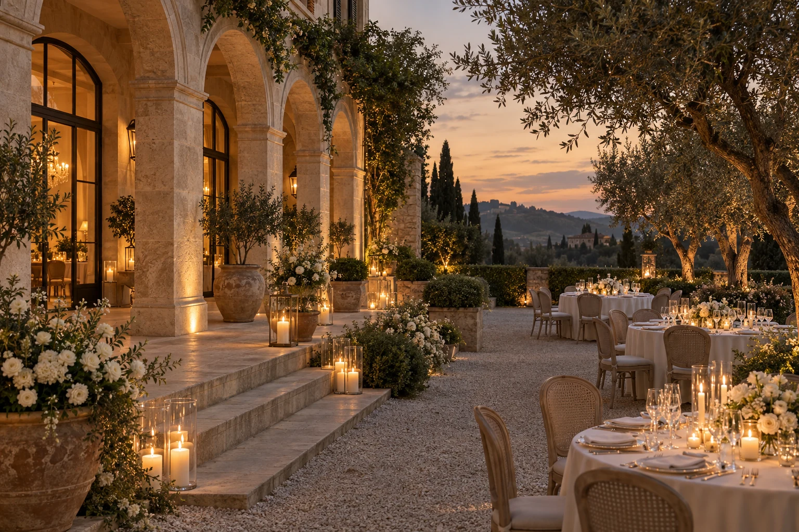

<!doctype html>
<html lang="ru">
<head>
  <meta charset="UTF-8"><meta name="viewport" content="width=device-width,initial-scale=1,viewport-fit=cover">
  <title>MAISON · Свадебный ресторан и банкетный дом</title>
  <meta name="description" content="MAISON — концепция свадебного ресторана. Пространства для церемонии и ужина, сезонная кухня и ваш собственный сценарий вечера.">
  <meta name="theme-color" content="#f5f0e8">
  <link rel="icon" href="data:image/svg+xml,%3Csvg xmlns='http://www.w3.org/2000/svg' viewBox='0 0 40 40'%3E%3Crect width='40' height='40' fill='%23191b1a'/%3E%3Ctext x='20' y='29' text-anchor='middle' font-family='serif' font-size='28' fill='%23e9dcc2'%3EM%3C/text%3E%3C/svg%3E">
  <link rel="stylesheet" href="./assets/restaurant.css">
  <link rel="stylesheet" href="./assets/restaurant-revision.css">
  <link rel="preload" as="image" href="./assets/restaurant-hall.webp" fetchpriority="high">
  
  
</head>
<body>
  <a class="skip" href="#main">К содержанию</a>
  

  

    

    
<svg viewBox="0 0 120 160" aria-hidden="true"><path d="M15 150V62a45 45 0 0 1 90 0v88M30 150V62a30 30 0 0 1 60 0v88"/><path d="M40 112V76l20 24 20-24v36"/></svg>MAISON

    <button class="opening-skip" tabindex="-1">Пропустить ↗</button>
  

  <header class="site-header">
    <a class="brand" href="#home" aria-label="MAISON — начало страницы">MAISON<small>BANQUET HOUSE</small></a>
    <button class="menu-toggle" aria-label="Открыть меню" aria-haspopup="dialog" aria-controls="site-menu"></button>
  </header>
  <dialog id="site-menu" class="menu-dialog">
MAISON<button class="menu-close" aria-label="Закрыть меню">✕</button>
<nav aria-label="Полное меню"><a href="#spaces"><small>01</small> Пространства ↗</a><a href="#cuisine"><small>02</small> Кухня ↗</a><a href="#details"><small>03</small> Детали ↗</a><a href="#contact"><small>04</small> Ваш вечер ↗</a></nav>
Есть вечера, которые остаются навсегда.
</dialog>
  <main id="main">
 <section id="home" class="hero threshold" aria-labelledby="hero-title">
  <svg class="clip-defs" width="0" height="0" aria-hidden="true"><defs><clipPath id="maison-portal" clipPathUnits="objectBoundingBox"><path id="portal-shape" d="M0 1 L0 .44 C0 -.14 1 -.14 1 .44 L1 1 Z"/></clipPath></defs></svg>
  
Свадебный дом / MAISON<h1 id="hero-title">Большим чувствам — большой дом.</h1>
Место, где ваш вечер обретает форму.

  
ПРОЙДИТЕ ВНУТРЬ

  
<a href="#details" class="line-link">Войти в дом ↓</a>
Камень. Свет. Люди. Всё остальное — ваша история.
A HOUSE FOR YOUR OCCASION

  LE SEUIL / ВХОД
 </section>

 <section id="details" class="table-scene" aria-labelledby="table-title">
  

   
Не просто красивый зал<h2 id="table-title">Место для своих.</h2>

   
Тёплый свет на камне. Тихий звон бокалов. Длинный стол, за которым все свои. Мы начинаем с того, каким вы хотите запомнить этот день.

   
<svg class="table-svg" viewBox="0 0 800 600" aria-hidden="true" xmlns="http://www.w3.org/2000/svg"><ellipse class="table-surface table-ink" cx="400" cy="300" rx="260" ry="165"/><ellipse class="table-ink" cx="400" cy="300" rx="244" ry="150" fill="none"/><g transform="translate(720.00 300.00) rotate(90)"><path class="table-ink" d="M-22-18Q0-32 22-18L20 18Q0 26-20 18Z" fill="none"/><path class="table-ink" d="M-22-18Q0-24 22-18" fill="none"/></g><g class="tablescape-linen" transform="translate(607.00 300.00)"><rect x="-27" y="-28" width="54" height="56" rx="3" fill="var(--color-table-plate)" opacity=".7"/><circle class="place-plate" r="22"/><circle class="table-ink" r="15" fill="none"/><path class="table-ink" d="M-31-18v38M-35-18v12h8v-12M31-18v38M31-18q8 4 0 17" fill="none"/></g><g transform="translate(677.13 412.50) rotate(120)"><path class="table-ink" d="M-22-18Q0-32 22-18L20 18Q0 26-20 18Z" fill="none"/><path class="table-ink" d="M-22-18Q0-24 22-18" fill="none"/></g><g class="tablescape-linen" transform="translate(579.27 356.00)"><rect x="-27" y="-28" width="54" height="56" rx="3" fill="var(--color-table-plate)" opacity=".7"/><circle class="place-plate" r="22"/><circle class="table-ink" r="15" fill="none"/><path class="table-ink" d="M-31-18v38M-35-18v12h8v-12M31-18v38M31-18q8 4 0 17" fill="none"/></g><g transform="translate(560.00 494.86) rotate(150)"><path class="table-ink" d="M-22-18Q0-32 22-18L20 18Q0 26-20 18Z" fill="none"/><path class="table-ink" d="M-22-18Q0-24 22-18" fill="none"/></g><g class="tablescape-linen" transform="translate(503.50 396.99)"><rect x="-27" y="-28" width="54" height="56" rx="3" fill="var(--color-table-plate)" opacity=".7"/><circle class="place-plate" r="22"/><circle class="table-ink" r="15" fill="none"/><path class="table-ink" d="M-31-18v38M-35-18v12h8v-12M31-18v38M31-18q8 4 0 17" fill="none"/></g><g transform="translate(400.00 525.00) rotate(180)"><path class="table-ink" d="M-22-18Q0-32 22-18L20 18Q0 26-20 18Z" fill="none"/><path class="table-ink" d="M-22-18Q0-24 22-18" fill="none"/></g><g class="tablescape-linen" transform="translate(400.00 412.00)"><rect x="-27" y="-28" width="54" height="56" rx="3" fill="var(--color-table-plate)" opacity=".7"/><circle class="place-plate" r="22"/><circle class="table-ink" r="15" fill="none"/><path class="table-ink" d="M-31-18v38M-35-18v12h8v-12M31-18v38M31-18q8 4 0 17" fill="none"/></g><g transform="translate(240.00 494.86) rotate(210)"><path class="table-ink" d="M-22-18Q0-32 22-18L20 18Q0 26-20 18Z" fill="none"/><path class="table-ink" d="M-22-18Q0-24 22-18" fill="none"/></g><g class="tablescape-linen" transform="translate(296.50 396.99)"><rect x="-27" y="-28" width="54" height="56" rx="3" fill="var(--color-table-plate)" opacity=".7"/><circle class="place-plate" r="22"/><circle class="table-ink" r="15" fill="none"/><path class="table-ink" d="M-31-18v38M-35-18v12h8v-12M31-18v38M31-18q8 4 0 17" fill="none"/></g><g transform="translate(122.87 412.50) rotate(240)"><path class="table-ink" d="M-22-18Q0-32 22-18L20 18Q0 26-20 18Z" fill="none"/><path class="table-ink" d="M-22-18Q0-24 22-18" fill="none"/></g><g class="tablescape-linen" transform="translate(220.73 356.00)"><rect x="-27" y="-28" width="54" height="56" rx="3" fill="var(--color-table-plate)" opacity=".7"/><circle class="place-plate" r="22"/><circle class="table-ink" r="15" fill="none"/><path class="table-ink" d="M-31-18v38M-35-18v12h8v-12M31-18v38M31-18q8 4 0 17" fill="none"/></g><g transform="translate(80.00 300.00) rotate(270)"><path class="table-ink" d="M-22-18Q0-32 22-18L20 18Q0 26-20 18Z" fill="none"/><path class="table-ink" d="M-22-18Q0-24 22-18" fill="none"/></g><g class="tablescape-linen" transform="translate(193.00 300.00)"><rect x="-27" y="-28" width="54" height="56" rx="3" fill="var(--color-table-plate)" opacity=".7"/><circle class="place-plate" r="22"/><circle class="table-ink" r="15" fill="none"/><path class="table-ink" d="M-31-18v38M-35-18v12h8v-12M31-18v38M31-18q8 4 0 17" fill="none"/></g><g transform="translate(122.87 187.50) rotate(300)"><path class="table-ink" d="M-22-18Q0-32 22-18L20 18Q0 26-20 18Z" fill="none"/><path class="table-ink" d="M-22-18Q0-24 22-18" fill="none"/></g><g class="tablescape-linen" transform="translate(220.73 244.00)"><rect x="-27" y="-28" width="54" height="56" rx="3" fill="var(--color-table-plate)" opacity=".7"/><circle class="place-plate" r="22"/><circle class="table-ink" r="15" fill="none"/><path class="table-ink" d="M-31-18v38M-35-18v12h8v-12M31-18v38M31-18q8 4 0 17" fill="none"/></g><g transform="translate(240.00 105.14) rotate(330)"><path class="table-ink" d="M-22-18Q0-32 22-18L20 18Q0 26-20 18Z" fill="none"/><path class="table-ink" d="M-22-18Q0-24 22-18" fill="none"/></g><g class="tablescape-linen" transform="translate(296.50 203.01)"><rect x="-27" y="-28" width="54" height="56" rx="3" fill="var(--color-table-plate)" opacity=".7"/><circle class="place-plate" r="22"/><circle class="table-ink" r="15" fill="none"/><path class="table-ink" d="M-31-18v38M-35-18v12h8v-12M31-18v38M31-18q8 4 0 17" fill="none"/></g><g transform="translate(400.00 75.00) rotate(360)"><path class="table-ink" d="M-22-18Q0-32 22-18L20 18Q0 26-20 18Z" fill="none"/><path class="table-ink" d="M-22-18Q0-24 22-18" fill="none"/></g><g class="tablescape-linen" transform="translate(400.00 188.00)"><rect x="-27" y="-28" width="54" height="56" rx="3" fill="var(--color-table-plate)" opacity=".7"/><circle class="place-plate" r="22"/><circle class="table-ink" r="15" fill="none"/><path class="table-ink" d="M-31-18v38M-35-18v12h8v-12M31-18v38M31-18q8 4 0 17" fill="none"/></g><g transform="translate(560.00 105.14) rotate(390)"><path class="table-ink" d="M-22-18Q0-32 22-18L20 18Q0 26-20 18Z" fill="none"/><path class="table-ink" d="M-22-18Q0-24 22-18" fill="none"/></g><g class="tablescape-linen" transform="translate(503.50 203.01)"><rect x="-27" y="-28" width="54" height="56" rx="3" fill="var(--color-table-plate)" opacity=".7"/><circle class="place-plate" r="22"/><circle class="table-ink" r="15" fill="none"/><path class="table-ink" d="M-31-18v38M-35-18v12h8v-12M31-18v38M31-18q8 4 0 17" fill="none"/></g><g transform="translate(677.13 187.50) rotate(420)"><path class="table-ink" d="M-22-18Q0-32 22-18L20 18Q0 26-20 18Z" fill="none"/><path class="table-ink" d="M-22-18Q0-24 22-18" fill="none"/></g><g class="tablescape-linen" transform="translate(579.27 244.00)"><rect x="-27" y="-28" width="54" height="56" rx="3" fill="var(--color-table-plate)" opacity=".7"/><circle class="place-plate" r="22"/><circle class="table-ink" r="15" fill="none"/><path class="table-ink" d="M-31-18v38M-35-18v12h8v-12M31-18v38M31-18q8 4 0 17" fill="none"/></g><g class="tablescape-flowers"><g transform="translate(285 265)"><path class="table-ink" d="M0 0q-20-30-37-25M0 0q20-30 37-25M0 0q-15 28-28 32M0 0q20 18 32 22" fill="none"/><ellipse class="table-flower" cx="9.00" cy="0.00" rx="12" ry="7" transform="rotate(0)"/><ellipse class="table-flower" cx="2.78" cy="8.56" rx="12" ry="7" transform="rotate(72)"/><ellipse class="table-flower" cx="-7.28" cy="5.29" rx="12" ry="7" transform="rotate(144)"/><ellipse class="table-flower" cx="-7.28" cy="-5.29" rx="12" ry="7" transform="rotate(216)"/><ellipse class="table-flower" cx="2.78" cy="-8.56" rx="12" ry="7" transform="rotate(288)"/><circle class="table-flower" r="6"/></g><g transform="translate(520 345)"><path class="table-ink" d="M0 0q-20-30-37-25M0 0q20-30 37-25M0 0q-15 28-28 32M0 0q20 18 32 22" fill="none"/><ellipse class="table-flower" cx="9.00" cy="0.00" rx="12" ry="7" transform="rotate(0)"/><ellipse class="table-flower" cx="2.78" cy="8.56" rx="12" ry="7" transform="rotate(72)"/><ellipse class="table-flower" cx="-7.28" cy="5.29" rx="12" ry="7" transform="rotate(144)"/><ellipse class="table-flower" cx="-7.28" cy="-5.29" rx="12" ry="7" transform="rotate(216)"/><ellipse class="table-flower" cx="2.78" cy="-8.56" rx="12" ry="7" transform="rotate(288)"/><circle class="table-flower" r="6"/></g><g transform="translate(515 265)"><path class="table-ink" d="M0 0q-20-30-37-25M0 0q20-30 37-25M0 0q-15 28-28 32M0 0q20 18 32 22" fill="none"/><ellipse class="table-flower" cx="9.00" cy="0.00" rx="12" ry="7" transform="rotate(0)"/><ellipse class="table-flower" cx="2.78" cy="8.56" rx="12" ry="7" transform="rotate(72)"/><ellipse class="table-flower" cx="-7.28" cy="5.29" rx="12" ry="7" transform="rotate(144)"/><ellipse class="table-flower" cx="-7.28" cy="-5.29" rx="12" ry="7" transform="rotate(216)"/><ellipse class="table-flower" cx="2.78" cy="-8.56" rx="12" ry="7" transform="rotate(288)"/><circle class="table-flower" r="6"/></g><g transform="translate(285 345)"><path class="table-ink" d="M0 0q-20-30-37-25M0 0q20-30 37-25M0 0q-15 28-28 32M0 0q20 18 32 22" fill="none"/><ellipse class="table-flower" cx="9.00" cy="0.00" rx="12" ry="7" transform="rotate(0)"/><ellipse class="table-flower" cx="2.78" cy="8.56" rx="12" ry="7" transform="rotate(72)"/><ellipse class="table-flower" cx="-7.28" cy="5.29" rx="12" ry="7" transform="rotate(144)"/><ellipse class="table-flower" cx="-7.28" cy="-5.29" rx="12" ry="7" transform="rotate(216)"/><ellipse class="table-flower" cx="2.78" cy="-8.56" rx="12" ry="7" transform="rotate(288)"/><circle class="table-flower" r="6"/></g></g><g class="tablescape-candles"><g transform="translate(380 220)"><ellipse class="table-candle" rx="10" ry="6"/><path class="table-ink" d="M-3 0v-30h6v30M0-32q-8-8 0-16q8 8 0 16Z" fill="none"/></g><g transform="translate(420 380)"><ellipse class="table-candle" rx="10" ry="6"/><path class="table-ink" d="M-3 0v-30h6v30M0-32q-8-8 0-16q8 8 0 16Z" fill="none"/></g><g transform="translate(480 300)"><ellipse class="table-candle" rx="10" ry="6"/><path class="table-ink" d="M-3 0v-30h6v30M0-32q-8-8 0-16q8 8 0 16Z" fill="none"/></g><g transform="translate(320 300)"><ellipse class="table-candle" rx="10" ry="6"/><path class="table-ink" d="M-3 0v-30h6v30M0-32q-8-8 0-16q8 8 0 16Z" fill="none"/></g></g></svg>

   
СветМягкий. Тёплый. Для разговоров до ночи.

ЦветыНемного белого. Много воздуха.

ЛюдиДостаточно близко, чтобы быть собой.

   
Представьте ваш стол
<button data-table-toggle="candles" aria-pressed="true">Свечи</button><button data-table-toggle="flowers" aria-pressed="true">Цветы</button><button data-table-toggle="linen" aria-pressed="true">Сервировка</button>

   ENSEMBLELA TABLE / ВМЕСТЕ ЗА СТОЛОМ
  

 </section>

 <section id="cuisine" class="cuisine cuisine-letter" aria-labelledby="cuisine-title">
  Искусство гостеприимства начинается здесь
  <h2 id="cuisine-title">ВКУС<small>которым хочется делиться.</small></h2>
  
01 / LA CUISINE

  
<article>Начало<h3>Первый бокал.</h3>
Лёгкие закуски и время познакомиться.
</article><article>Середина<h3>Долгий ужин.</h3>
Сезонное меню, любимые вкусы и пожелания каждого гостя.
</article><article>Продолжение<h3>Ещё один десерт.</h3>
Неспешный финал. И повод задержаться за столом.
</article><a href="#contact" class="line-link">Собрать меню ↗</a>

 </section>

 <section id="spaces" class="gallery house-archive" aria-labelledby="gallery-title">
  
Дом в трёх штрихах<h2 id="gallery-title">САЛОН. САД. ТИШИНА.</h2>
Разные пространства. Одна возможность быть рядом.

<button data-gallery-prev aria-label="Предыдущий кадр">←</button><button data-gallery-next aria-label="Следующий кадр">→</button>

  

   <figure class="archive-salon">01<figcaption><h3>Le salon.</h3>
Высокие арки. Длинные столы. Большой вечер с любимыми людьми.
<a href="#contact" class="line-link" data-space-choice="Большой салон">Выбрать салон ↗</a></figcaption></figure>
   <figure class="archive-garden">02<figcaption><h3>Le jardin.</h3>
Церемония на воздухе. Первый бокал в вечернем саду.
<a href="#contact" class="line-link" data-space-choice="Садовая терраса">Выбрать сад ↗</a></figcaption></figure>
   <figure class="archive-private">03<figcaption><h3>La table privée.</h3>
Близкие люди за одним столом. История, которой не нужна сцена.
<a href="#contact" class="line-link" data-space-choice="Камерный вечер">Выбрать ужин ↗</a></figcaption></figure>
  

Каждый кадр — приглашение остаться01 / 03

 </section>

 <section class="light-scene" aria-labelledby="light-title">

Искусство одного вечера
<h2 id="light-title">Сначала — «да».Потом — до утра.</h2>
<svg viewBox="0 0 140 140"><circle cx="70" cy="70" r="65"/><path d="M70 6v8M134 70h-8M70 134v-8M6 70h8"/><path class="clock-hand" d="M70 70V25"/><circle cx="70" cy="70" r="3"/></svg>ОТ ПЕРВОГО ТОСТА ДО ПОСЛЕДНЕГО ТАНЦА
<a class="line-link light-action" href="#contact">Представить вечер ↗</a>
</section>

 <section id="contact" class="contact section-pad" aria-labelledby="contact-title">
04 / Ваш вечер<h2 id="contact-title">Давайте представим его.</h2>
Расскажите, что для вас важно. Дата, любимые люди и ваше настроение.

<a data-contact="map" hidden class="line-link">Построить маршрут ↗</a>

Сохраните пожелания — к ним удобно вернуться при обсуждении площадки.

<form class="enquiry-form">
<label>Ваше имя<input name="name" autocomplete="given-name" required maxlength="100" placeholder="Как к вам обращаться"></label><label>Дата вечера<input type="date" name="date" required></label>

<label>Количество гостей<input type="number" name="guests" min="2" max="1000" required inputmode="numeric" placeholder="Например, 60"></label><label>Пространство<select name="space"><option>Большой салон</option><option>Садовая терраса</option><option>Камерный вечер</option><option>Пока выбираю</option></select></label>
<label>Пожелания<textarea name="message" rows="3" maxlength="2000" placeholder="Каким вы представляете этот вечер?"></textarea></label><button class="request-button" type="submit">Сохранить план↗</button>
Пожелания сохранятся файлом на вашем устройстве.

</form></section>
</main>

  <footer class="site-footer">
У хороших вечеров есть свой дом.<button class="replay" data-replay>Открыть снова ↻</button>

MAISON

Свадебный ресторан · Банкетный домДемонстрационная концепция
</footer>
</body></html>
